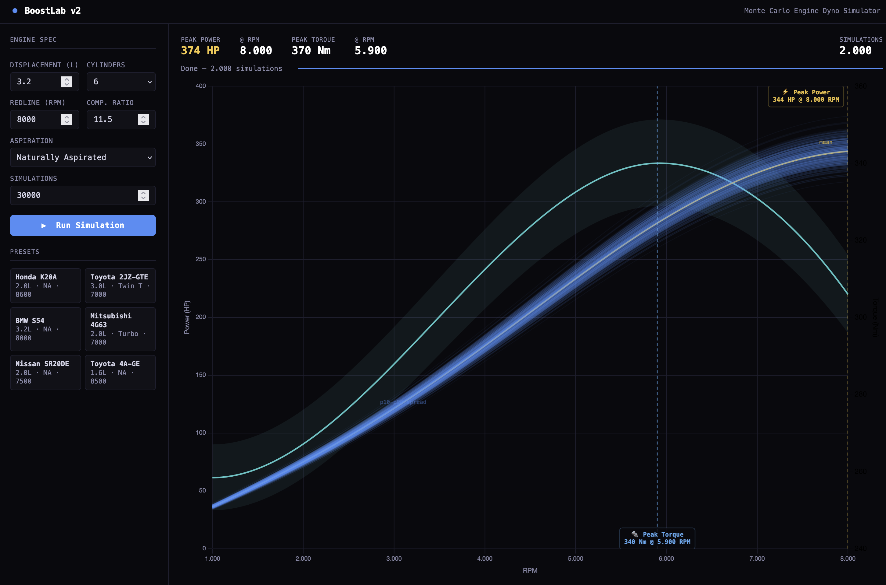
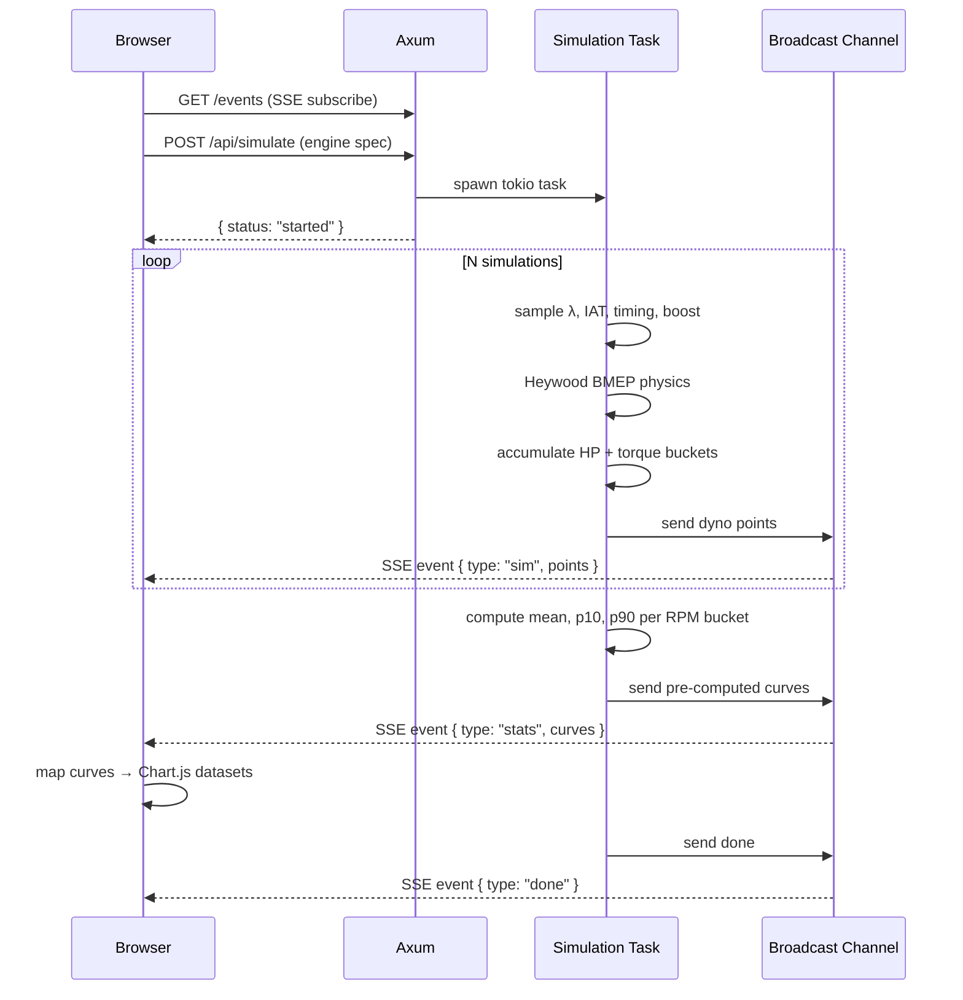

# BoostLab

A Monte Carlo engine dyno simulator that tells you not just what your engine *might* make — but how confident you should be in that number.

This repository contains only the technical documentation, architectural designs, and mathematical modelling decisions for the **BoostLab** project. The implementation is in a private repository.

---

## Why this exists

Every dyno calculator on the internet gives you a single number. A tuner knows that's fiction: back-to-back pulls on the same car on the same day can vary 5–10 HP depending on intake air temperature, fuel quality, how well the tune holds lambda, and a dozen other things outside your control.

BoostLab runs hundreds of simulations in parallel, each one sampling a realistic spread of the variables a tuner actually moves — AFR/lambda, intake air temperature, ignition timing margin, boost target tolerance — and shows you the full distribution. The p10–p90 band on the dyno chart is the honest answer: *this is the range of outcomes you should expect across a real session.*

It was built as a clean-room rewrite of an earlier prototype, collapsing a multi-service architecture into a single Rust binary that is easy to run, easy to understand, and fast enough to stream 300 live simulation curves to the browser in under two seconds.

---

## Documents

- [**Architecture**](ARCHITECTURE.md) - Deep dive into the system design, communication protocols, and concurrency model.
- [**Modelling**](MODELLING.md) - Detailed explanation of the physics engine, Heywood BMEP correlations, and Monte Carlo sampling logic.

---

## How it works

---

## Engine presets

| Preset | Displacement | Aspiration | Redline |
|---|---|---|---|
| Honda K20A | 2.0 L | NA | 8 600 RPM |
| Toyota 2JZ-GTE | 3.0 L | Twin Turbo / 1.0 bar | 7 000 RPM |
| BMW S54 | 3.2 L | NA | 8 000 RPM |
| Mitsubishi 4G63 | 2.0 L | Single Turbo / 0.9 bar | 7 000 RPM |
| Nissan SR20DE | 2.0 L | NA | 7 500 RPM |
| Toyota 4A-GE | 1.6 L | NA | 8 500 RPM |

---

## Performance

Measured running locally with a k6 load test.

**Single simulation (2.0L NA, 1 000 runs)**

| Metric | Value |
|---|---|
| Total time | ~1.4s |
| Per-simulation (pure physics) | ~0.005ms |

**Concurrent simulations (1 000 runs each)**

| Concurrent users | p50 | p95 | max | Failures |
|---|---|---|---|---|
| 5 | 2.08s | 2.12s | 2.13s | 0 |
| 1 000 | 24.24s | 29.92s | 30.73s | 0 |

At 5 concurrent simulations the overhead over a single run is negligible — all finish within 50ms of each other. At 1 000 concurrent simulations (1 000 000 total physics calls) the server completes everything without dropping a request, with a ~12× slowdown for a 200× increase in concurrency.

---

## Stack

| Layer | Tech |
|---|---|
| Server | Rust · Axum 0.7 · Tokio |
| Streaming | Server-Sent Events (SSE) |
| Physics | Custom — Heywood BMEP + smoothstep VE curve |
| Frontend | Vanilla JS · Chart.js 4 · chartjs-plugin-annotation |
